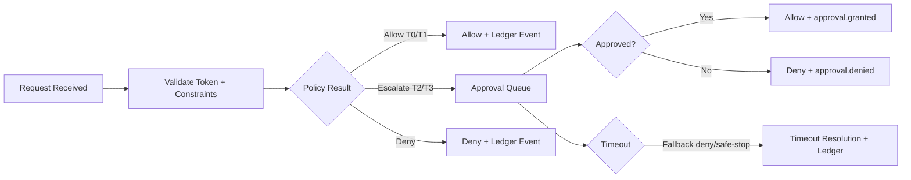
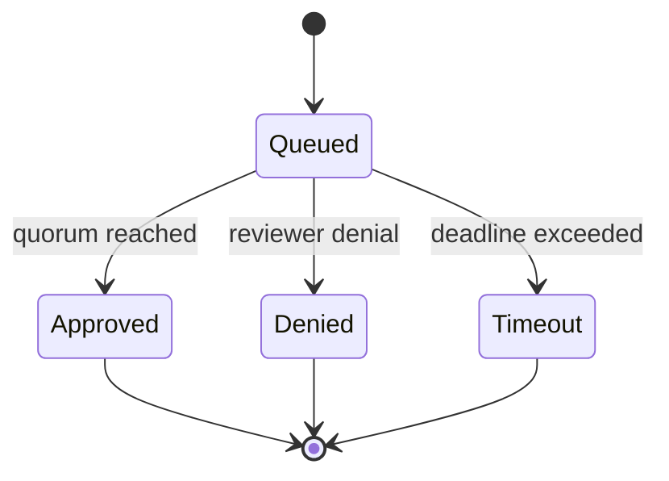
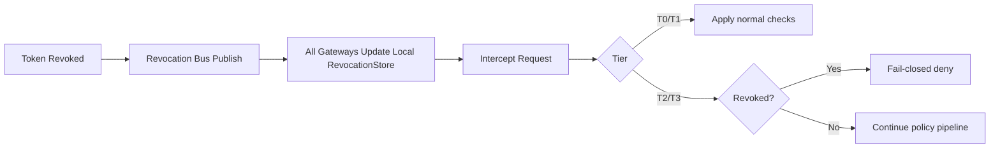

# SINT State Machines (Mermaid)

Tracking issue: #20

## Policy Decision Flow

```mermaid
flowchart LR
  A["Request Received"] --> B["Validate Token + Constraints"]
  B --> C{"Policy Result"}
  C -->|Allow T0/T1| D["Allow + Ledger Event"]
  C -->|Escalate T2/T3| E["Approval Queue"]
  C -->|Deny| F["Deny + Ledger Event"]
  E --> G{"Approved?"}
  G -->|Yes| H["Allow + approval.granted"]
  G -->|No| I["Deny + approval.denied"]
  E --> J{"Timeout"}
  J -->|Fallback deny/safe-stop| K["Timeout Resolution + Ledger"]
```

## Approval Queue Lifecycle

```mermaid
stateDiagram-v2
  [*] --> Queued
  Queued --> Approved: quorum reached
  Queued --> Denied: reviewer denial
  Queued --> Timeout: deadline exceeded
  Approved --> [*]
  Denied --> [*]
  Timeout --> [*]
```

## Revocation + Enforcement

```mermaid
flowchart LR
  A["Token Revoked"] --> B["Revocation Bus Publish"]
  B --> C["All Gateways Update Local RevocationStore"]
  C --> D["Intercept Request"]
  D --> E{"Tier"}
  E -->|T0/T1| F["Apply normal checks"]
  E -->|T2/T3| G{"Revoked?"}
  G -->|Yes| H["Fail-closed deny"]
  G -->|No| I["Continue policy pipeline"]
```

