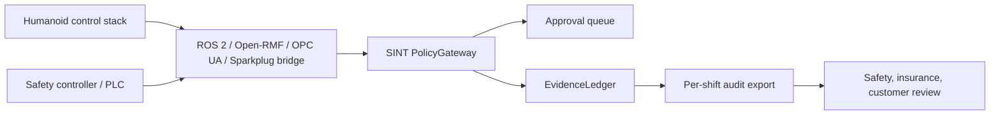

# Humanoid Warehouse Pilot

This guide defines the first production-adjacent pilot path for humanoid
warehouse and Robot-as-a-Service deployments.

The target pilot is 10-50 robots over 90 days, using the existing SINT
enforcement stack rather than a vendor-specific adapter. The goal is to produce
externally reviewable evidence for safety, insurance, and customer operations
teams.

## Scope

Use this pilot for:

- humanoid warehouse movement, tote handling, inspection, and handoff tasks
- mixed fleets where humanoids interact with AMRs, conveyors, zones, or safety
  controllers
- RaaS deployments where the robot provider needs auditable liability evidence

Do not use this pilot to claim certified compliance. The output is an evidence
package for review, not a regulatory certification.

## Supported Integration Surface

The first pilot path reuses existing bridges:

- ROS 2 for robot control topics and action goals
- Open-RMF for fleet dispatch, traffic reservation, and handoff workflows
- OPC UA / PLC safety-controller state for permits, interlocks, and e-stop
- MQTT Sparkplug for industrial telemetry and command channels
- EvidenceLedger for hash-chained shift evidence

Vendor-specific APIs such as Arc, Helix, BrainNet, or Gemini Robotics should be
added only after a design partner provides API access or a simulator contract.

## Canonical Humanoid Resources

The H1 conformance profile defines the canonical resource shape:

```text
humanoid://fleet/<fleet-id>/robot/<robot-id>/status
humanoid://fleet/<fleet-id>/robot/<robot-id>/plan
humanoid://fleet/<fleet-id>/robot/<robot-id>/base/cmd_vel
humanoid://fleet/<fleet-id>/robot/<robot-id>/arm/<arm-id>/joint_commands
humanoid://fleet/<fleet-id>/robot/<robot-id>/end-effector/<tool-id>
humanoid://fleet/<fleet-id>/robot/<robot-id>/handoff
humanoid://fleet/<fleet-id>/robot/<robot-id>/workspace/novel/enter
humanoid://fleet/<fleet-id>/robot/<robot-id>/estop
```

Tier defaults:

| Intent | Tier |
| --- | --- |
| status, battery, pose | T0 observe |
| plan, reserve zone | T1 prepare |
| move base, move arm, grip, handoff, battery swap | T2 act |
| enter novel workspace, disable safety envelope, e-stop override | T3 commit |

## Pilot Topology



All actuation requests must pass through `PolicyGateway.intercept()`. Bridges
translate protocol-specific calls into SINT requests; they do not make
authorization decisions.

## 90-Day Pilot Plan

### Days 0-14: Baseline

- inventory robots, AMRs, conveyors, doors, lifts, and safety controllers
- choose 3-5 representative workflows:
  - observe status
  - stage grasp plan
  - navigate base
  - move arm
  - handoff to AMR
  - emergency stop
- configure capability tokens for robot, operator, and service identities
- run fixture conformance locally

```bash
pnpm --filter @pshkv/conformance-tests test -- src/humanoid-profile-conformance.test.ts
pnpm --filter @pshkv/conformance-tests test -- src/humanoid-warehouse-pilot-conformance.test.ts
```

### Days 15-45: Shadow Mode

- route requests through SINT and log decisions without blocking production
  actuation
- compare SINT assigned tiers with the site's existing safety decisions
- verify EvidenceLedger hash-chain integrity daily
- collect latency metrics for T0/T1/T2/T3 paths

### Days 46-75: Enforced Pilot

- enforce T2/T3 approval requirements for selected workflows
- require handoff receipts for humanoid-to-AMR tote transfers
- require hardware permit context for selected industrial-cell actions
- simulate e-stop, permit drop, stale permit, and shared-zone conflict cases

### Days 76-90: External Review

- export per-shift evidence as JSON Lines
- replay at least one incident or near miss from the hash chain
- give the export to one external reviewer:
  - insurer
  - safety auditor
  - customer safety team
  - independent evaluator
- record reviewer feedback as adoption evidence

## Per-Shift Evidence Export

The canonical export contract is executable in:

```text
packages/conformance-tests/fixtures/physical-ai/humanoid-warehouse-pilot.v1.json
packages/conformance-tests/src/humanoid-warehouse-pilot-conformance.test.ts
```

Required row fields:

- `shiftId`
- `siteId`
- `robotId`
- `eventId`
- `sequenceNumber`
- `timestamp`
- `eventType`
- `agentId`
- `tokenId`
- `decision`
- `assignedTier`
- `resource`
- `action`
- `approvalId`
- `operatorId`
- `incidentId`
- `receiptRequired`
- `eventHash`
- `previousHash`

Optional row fields:

- `handoffReceiptId`
- `safetyControllerId`
- `latencyMs`
- `denialPolicy`
- `rollbackTargetRef`

For T2/T3 rows, the export must include review evidence: an approval,
denial, incident, or rollback reference. Handoff rows must include a handoff
receipt. E-stop rows must include incident and rollback or deny context.

## Success Criteria

A pilot is successful when:

- 100% of selected workflows pass through `PolicyGateway.intercept()`
- hash-chain verification passes for every exported shift
- every T2/T3 action has approval, denial, incident, or rollback evidence
- every humanoid-to-AMR handoff has a receipt
- at least one external reviewer can use the export without internal SINT team
  interpretation

## Deliverables

- deployment topology
- conformance run output
- per-shift JSON Lines export
- incident replay notes
- external reviewer feedback
- list of production blockers before expanding from 10-50 robots

