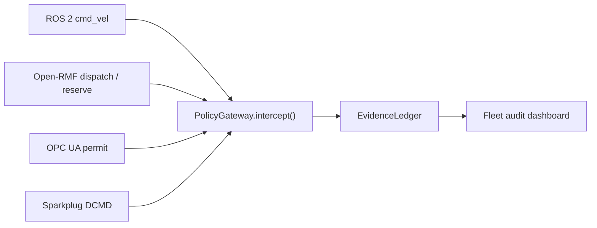

# Multi-Vendor Fleet Governance

This guide defines the H4 governance contract for mixed humanoid, AMR,
conveyor, and human-worker warehouse fleets.

The goal is not to add another vendor bridge. The goal is to make the same
physical intent reviewable across existing ingress paths:

- ROS 2 motion topics
- Open-RMF dispatch and zone reservations
- OPC UA safety and conveyor permits
- MQTT Sparkplug telemetry and commands

The executable fixture is
`packages/conformance-tests/fixtures/physical-ai/humanoid-multivendor-fleet.v1.json`.
The conformance test is
`packages/conformance-tests/src/humanoid-multivendor-fleet-conformance.test.ts`.

## Contract

H4 adds four fleet-level requirements:

- Handoffs require auditable receipts.
- Shared-zone conflicts fail closed.
- Cross-bridge replay preserves the same physical intent.
- Dashboard queries for 1,000+ robots use bounded filters.



## Handoff Receipts

A humanoid-to-AMR handoff is not complete just because both robots report task
success. The receipt must bind:

- source robot
- target robot
- workspace
- payload reference
- approval id
- operator id
- event hash
- previous hash

Missing receipt evidence is rejected by conformance. This creates a clean audit
path for payload custody, incident review, insurance review, and partner
deployment reports.

## Shared-Zone Conflicts

Mixed fleets need a site-level claim model because different systems may try to
reserve the same space:

- a humanoid reserves `zone-aisle-a17`
- an AMR tries to reserve the same zone in an overlapping time window
- the second claim denies with `FLEET_ZONE_CONFLICT`
- a non-overlapping or different-zone claim can proceed

The reservation path is T1 because it prepares a future physical action. The
subsequent movement or transfer remains T2 and requires review before
actuation.

## Cross-Bridge Replay

The same physical intent, `move_payload_to_packout`, is replayed through:

| Bridge | Example path | Expected tier |
| --- | --- | --- |
| ROS 2 | `ros2:///cmd_vel` | T2 |
| Open-RMF | `open-rmf://fleet/warehouse-fleet/dispatch` | T2 |
| OPC UA | conveyor transfer permit call | T2 |
| Sparkplug | AMR `DCMD` command topic | T2 |

No ingress path is allowed to downgrade the same physical movement into a
T0/T1-only path.

## Dashboard Queries

The first 1,000+ robot audit model requires bounded filters:

- high-consequence events by robot, tier, and time range
- workspace conflicts by zone, policy violation, and time range
- handoff receipts by payload, receipt id, and event hash
- e-stop and rollback events by fleet, event type, and incident id

These are requirements for the future dashboard and storage benchmark work in
H4. They should become API/query benchmarks before the fleet dashboard is
claimed production-ready.

## Verification

Run:

```bash
pnpm --filter @pshkv/conformance-tests test -- src/humanoid-multivendor-fleet-conformance.test.ts
pnpm --filter @pshkv/conformance-tests test:fixtures
```

## Exit Criteria

- No handoff can occur without an auditable receipt.
- Conflicting robot claims on the same workspace deny fail-closed.
- ROS 2, Open-RMF, OPC UA, and Sparkplug replay paths preserve T2 semantics for
  the same physical intent.
- Dashboard requirements are backed by executable query/filter contracts.
