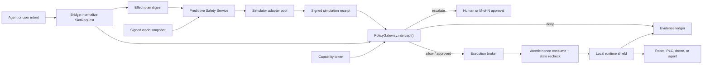

# Proof-Carrying Effects and Predictive Safety Roadmap

Status: implementation started August 2026
Owner: SINT protocol and gateway maintainers
Decision horizon: production pilot in 12 weeks

## Executive Decision

Build a general **proof-carrying effects layer**, with physical simulation as
its Predictive Safety Plane specialization. This is not a new authorization
system and not a generic LLM world model.

The simulation service predicts consequences and emits signed evidence. The
existing `PolicyGateway.intercept()` remains the only component allowed to
authorize, deny, transform, or escalate. A small local runtime shield remains
the final line of defense because a remote simulator cannot safely control a
high-frequency servo loop or protect against state changes after simulation.

The stable product surface is the signed receipt and its verification rules,
not a proprietary simulator. Filesystem overlays, database rollback
transactions, cloud plans, Kubernetes dry-runs, remote-agent prepare/commit,
geometry checks, physics engines, and vendor digital twins all implement the
same `EffectSimulator` contract.

The target architecture is therefore three cooperating layers:

1. **Policy Gateway** — identity, capability, constraints, approval, audit.
2. **Predictive Safety Service** — world snapshot, deterministic and sampled
   simulation, uncertainty, signed receipt.
3. **Execution Broker + Runtime Shield** — atomic receipt consumption,
   time-of-check/time-of-use validation, local invariant enforcement, E-stop.

This separation matches established policy-decision/policy-enforcement design:
OPA describes the policy decision point as making decisions for enforcement
points, while SINT adds a predictive evidence producer in front of that
decision. See [OPA deployment architecture](https://www.openpolicyagent.org/docs/deploy).

## Why This Is Worth Building

NIST describes digital twins as synchronized models used to observe, diagnose,
predict, and optimize near-real-time physical operations, while emphasizing
verification, validation, and uncertainty quantification. That supports SINT's
direction, but it also argues against treating a simulator's `pass` as truth.
See [NIST Digital Twins for Advanced Manufacturing](https://www.nist.gov/programs-projects/digital-twins-advanced-manufacturing)
and [NIST IR 8356](https://www.nist.gov/news-events/news/2025/02/security-and-trust-considerations-digital-twin-technology-nist-releases-ir).

NIST has also demonstrated that comparing a physical process with a near-real-
time twin can detect cyber-physical attacks and distinguish them from ordinary
anomalies. That makes the same plane useful after launch for shadow evaluation
and drift detection, not only before action execution. See the
[NIST digital-twin cyberattack study](https://www.nist.gov/publications/digital-twin-based-cyber-attack-detection-framework-cyber-physical-manufacturing).

## Reference Architecture

Run the predictive service in a separate trust boundary and failure domain. A
headless server pool is practical: Gazebo explicitly separates backend server
and frontend client processes and supports server-only execution. Gazebo
Harmonic is also the recommended pairing for ROS 2 Jazzy. See
[Gazebo architecture](https://gazebosim.org/docs/harmonic/architecture/),
[headless Gazebo](https://gazebosim.org/docs/harmonic/getstarted/), and
[ROS REP-2000](https://www.ros.org/reps/rep-2000.html).

The separate service must not sit in the hard real-time path. It evaluates
plans, trajectories, batches, or bounded action windows. The robot-side shield
still enforces velocity, force, geofence, interlock, and E-stop invariants at
control-loop speed.

## Trust Model

The simulator is untrusted until its evidence is verified. Every receipt must
be bound to:

- the exact `SintRequest`, excluding the receipt itself
- the exact resource, action, and parameters (effect plan)
- the complete signed capability token
- a fresh world-state digest and validity window
- simulator backend, version, model digest, and optional image digest
- scenario-set digest, run count, seeds, coverage, and uncertainty
- explicit assumptions and unsupported phenomena
- a short expiry, unique nonce, durable artifact digest, signer, and signature

The simulation service should eventually use workload identity rather than
static host secrets. SPIFFE provides short-lived, verifiable workload identity
through its Workload API and trust bundles; use a distinct trust domain for
production simulation. See the [SPIFFE Workload API](https://spiffe.io/docs/latest/spiffe-specs/spiffe_workload_api/)
and [SPIFFE trust-domain concepts](https://spiffe.io/docs/latest/spiffe/concepts/).

## Policy by Consequence Tier

| Tier | Simulation mode | Decision rule | Latency target |
|---|---|---|---|
| T0 observe | None | Log normally | Existing gateway budget |
| T1 prepare | Shadow by default | Never block until calibrated; promote selected writes later | Under 250 ms async |
| T2 act | Mandatory for supported plan-level actions | Missing, stale, forged, unsafe, indeterminate, or model-gap evidence denies | p95 under 1 s, or use pre-simulated corridor |
| T3 commit | Physics/twin grade plus configured M-of-N quorum | Passing receipt can only support escalation; never auto-authorize | Workflow-dependent |
| Servo/control tick | No remote simulation | Local runtime shield and certified controller | Device-loop budget |

## Simulator Strategy

Adopt an adapter interface and avoid betting the protocol on one engine.

- **First backend: Gazebo Harmonic** for open ROS 2 integration, deterministic
  headless CI, and the fastest path to the current bridge/capsule ecosystem.
- **Second backend: a high-fidelity GPU simulator** for perception-heavy and
  contact-rich scenarios after the evidence contract is stable.
- **Industrial adapters:** ABB RobotStudio, KUKA.Sim, FANUC ROBOGUIDE,
  RoboDK, PLC emulators, and customer digital twins. These produce the same
  SINT receipt and never receive special authorization privileges.
- **Analytic fast path:** for simple envelopes, use deterministic reachability,
  collision, and constraint checks instead of launching full physics.

The engine is replaceable; the receipt contract, conformance suite, and gateway
decision semantics are the product moat.

The normative implementation contract is
[EffectSimulator and SimulationReceiptV2](../specs/effect-simulator.md).

## Delivery Plan

### Phase 0 — Contract and choke point (landed in this change)

- [x] production `SimulationEvidenceReceipt` TypeScript and Zod contracts
- [x] versioned JSON Schema for external implementers
- [x] canonical request, effect-plan, and token digests
- [x] Ed25519 signer allowlist and signature verification
- [x] receipt/world freshness, expiry, uncertainty, backend, scenario, outcome,
  collision, zone-violation, and model-gap checks
- [x] consumed-nonce replay check with in-memory reference store
- [x] fail-closed integration inside `PolicyGateway.intercept()`
- [x] tests for valid, missing, forged, stale, mismatched, replayed, and
  indeterminate evidence
- [x] conformance invariant: a passing simulation never authorizes T2 actuation
- [x] `SimulationReceiptV2` evidence grades and subject/controller bindings
- [x] tier matrix selects evidence depth after CSML/runtime escalation
- [x] T3 policy can require physics/twin evidence plus a minimum human quorum
- [x] non-authorizing `preflightSimulation()` returns the exact effect plan and
  evidence requirement before final interception
- [x] backend-neutral `EffectSimulator` interface exported from core
- [x] reference deterministic bounded-motion worker with signed V2 receipts
- [x] joint, workspace, velocity, force, clearance, collision, and safety-zone
  checks with explicit fail/indeterminate semantics
- [x] end-to-end conformance from gateway preflight through evidence-gated T2
  escalation

### Phase 1 — Vertical slice (weeks 1–3)

- [x] create `@pshkv/predictive-safety-client` and a typed HTTP worker contract
- [x] package the deterministic worker as an independently runnable service
  with production auth/key validation, durable artifacts, and graceful shutdown
- [ ] add gRPC transport only when a design partner requires it
- [ ] implement a headless Gazebo Harmonic worker for one bounded navigation
  action and one pick-and-place action
- [x] create a world-snapshot adapter from ROS 2 state, transforms, maps,
  obstacles, and safety-controller state
- [x] persist deterministic traces and canonical ROS 2 world snapshots in
  content-addressed storage with a durable filesystem reference implementation
- [ ] add Postgres/Redis-backed nonce state and signer-key rotation
- [x] append receipt-verified and receipt-rejected decisions to
  `EvidenceLedger`, including the tier and enforcement mode
- [x] append receipt-issued events at the simulator trust boundary; issuance
  fails closed when the Evidence Ledger or its durable persistence sink fails
- [ ] append simulation-drift events after observed execution measurements
  exist
- [x] run T1 shadow mode on recorded fixtures; missing, unsafe, and passing
  evidence is audited without blocking production

Exit gate: deterministic replay succeeds; p95 receipt latency is under one
second; zero unsigned receipts are accepted; simulator crash/timeouts fail
closed for the canary policy.

### Phase 2 — Execution integrity (weeks 4–6)

- [x] add a reference execution broker that atomically consumes the receipt
  nonce immediately before its single dispatch attempt
- [x] re-read world epoch immediately before dispatch and reject drift beyond
  the declared tolerance
- [ ] bind approval resolution and execution receipt to the simulation receipt
- [ ] implement a local runtime shield in ROS 2 and one PLC/OPC UA path
- [ ] preserve unconditional E-stop behavior independent of every simulator
- [ ] support pre-simulated corridors/skill envelopes for low-latency T2 paths

Exit gate: concurrent replay attempts result in exactly one dispatch; stale
world epochs never reach hardware; loss of the simulation plane triggers the
declared safe fallback without disabling E-stop or the local shield.

### Phase 3 — Calibration and pilot (weeks 7–9)

- [ ] compare predicted vs observed clearance, force, duration, collision, and
  controller outcomes in shadow mode
- [ ] publish per-model calibration error and confidence thresholds
- [ ] introduce scenario fuzzing for sensor delay, actor motion, localization
  error, dropped messages, actuator lag, and adversarial parameters
- [ ] require human review when uncertainty or unsupported-phenomena fields are
  non-empty
- [ ] canary mandatory evidence for one T2 action family at one pilot site

Exit gate: false-negative safety escapes are zero in the agreed evaluation
set; false-positive block rate is below 2%; every observed model drift has a
traceable receipt and correction event.

### Phase 4 — Multi-backend production (weeks 10–12)

- [ ] add one GPU/high-fidelity backend and one vendor industrial simulator
- [ ] require two independent models for selected T3 actions
- [ ] deploy workload identity, mTLS, signer rotation, image attestation, quotas,
  and tenant isolation
- [ ] add regional worker pools, circuit breakers, bounded queues, and signed
  cache entries keyed by plan + world + model digests
- [ ] publish a predictive-safety conformance profile and operator runbook

Exit gate: failover and compromised-worker exercises pass; receipts remain
portable across backends; the gateway can revoke a signer or model digest
without redeploying bridges.

## What Not to Build Yet

- Do not put an LLM in charge of the allow/deny decision.
- Do not claim full-world prediction; declare model boundaries explicitly.
- Do not simulate every tool call or control tick.
- Do not let bridges accept a receipt or bypass `PolicyGateway.intercept()`.
- Do not let a passing result loosen capability-token constraints.
- Do not auto-consume a nonce during policy evaluation; consumption belongs in
  the execution broker so approval retries remain safe and idempotent.
- Do not couple the contract to a proprietary simulator before two adapters
  prove portability.

## Pilot Scorecard

Track these weekly:

- unsafe outcomes caught before dispatch
- observed safety escapes and near misses
- false-positive deny rate by action family
- prediction error for clearance, force, duration, and final pose
- p50/p95/p99 simulation and gateway latency
- stale-world, invalid-signature, context-mismatch, replay, and model-gap counts
- percentage of receipts reproducible from retained artifacts and seeds
- model/backend drift and calibration age
- simulator availability and safe-fallback activation
- human overrides, with reason and downstream outcome

The go/no-go criterion is evidence quality, not demo quality: SINT should only
make simulation mandatory for an action family after shadow data shows that the
model is calibrated, reproducible, fast enough, and safer than policy alone.
